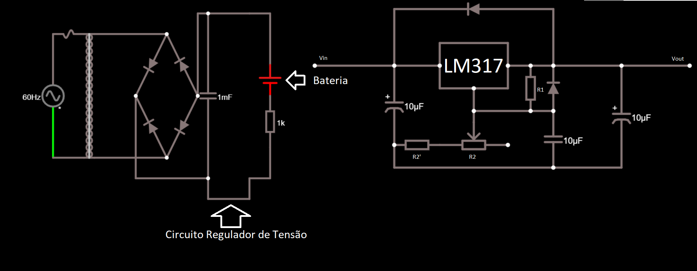
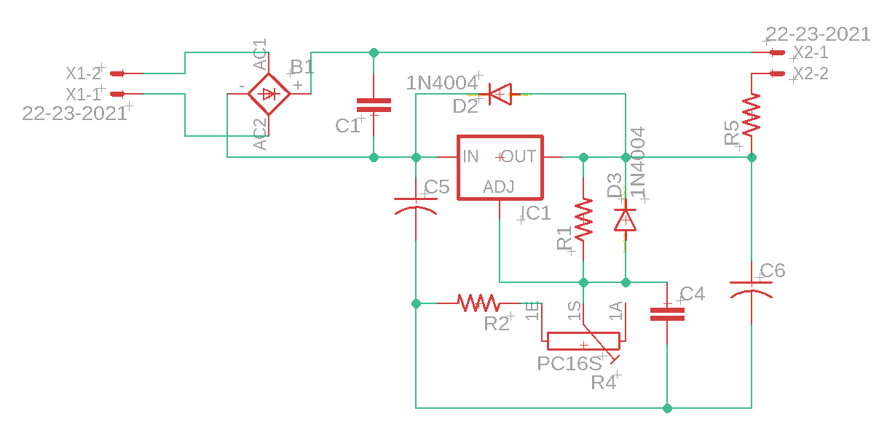
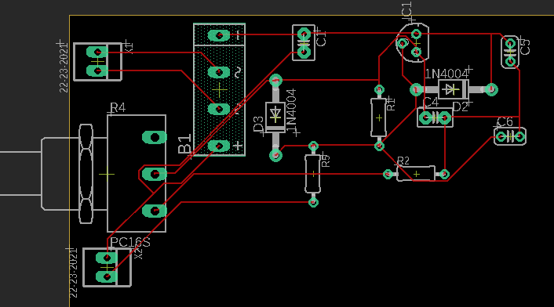

# Projeto#1: Fonte de Tensão

## DESCRIÇÃO:
Projeto de uma Fonte de Tensão entre 3V a 12V com capacidade de 100mA

## Diagrama da Fonte

### Link para o circuito
http://tinyurl.com/ydc6hb5x

### Explicação dos valores escolhidos:
- Capacitor:
  
  A partir da equação para cálculo da tensão:
  
   
  
  Assumindo  e sabendo que , temos:
  
  
  
  Dessa forma, um Capacitor de  é suficiente para a fonte do projeto.

- Circuito Regulador de Tensão:
  
  A partir da datasheet da "Texas Instruments"(https://tinyurl.com/y7voskoq), obtêm-se a fórmula:

  
	
  Onde:
	-  é a tensão de saída.
	-  é um resistor.
	-  é o potênciometro.
	-  é a resistência em série do potênciômetro.
  
  Assim, para obter  na saída com o potênciometro em seu valor mínimo e  com o potênciometro em seu valor máximo, os seguintes valores são necessários para satisfazer a equação:
  
  Para , o potêncimetro deve estar em um valor próximo de  e . Logo, .

  E para , utilizando , .
	
### Video da simulação do projeto
https://youtu.be/yiT338iD_G4

### Componentes:
* Diodo (x6) - R$ 0,66
* Transformador 110v para 12v - R$ 35,00
* Capacitor 100μF - R$ 0,10
* Capacitor 10μF (x3) - R$ 0,42
* Potenciômetro 5kΩ - R$ 1,09
* Resistor 1kΩ - R$ 0,08
* Resistor 700Ω (a partir de (1x) 1kΩ + (1x) 100Ω em paralelo com (2x) 220Ω + (1x) 100Ω) - R$ 0,40
* LM 317 - R$ 2,75
* **TOTAL: R$ 40,50**

## Esquemático do circuito no EAGLE

## PCB do circuito no EAGLE

## Participantes:
* **Gabriel da Cunha Dertoni(11795717)** - [GabrielDertoni](https://github.com/GabrielDertoni)

* **Eduardo Henrique Porto Silva(11796656)**  - [EduardoPortoSilva](https://github.com/EduardoPortoSilva)

* **Pedro Henrique Borges Monici(10816732)** - [pedromonici](https://github.com/pedromonici)

* **Tulio Santana Ramos(11795526)** - [Tulip-bcc](https://github.com/Tulip-bcc)

