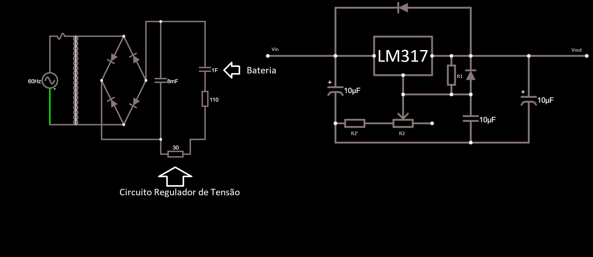

# Projeto#1: Fonte de Tensão

## DESCRIÇÃO:
Projeto de uma Fonte de Tensão entre 3V a 12V com capacidade de 100mA

## Diagrama da Fonte

### Link para o circuito

###Explicação dos valores escolhidos:
- Capacitor:
   
  Assumindo  e sabendo que ,temos:
  
  Dessa forma, um Capacitor de  é suficiente para a fonte do projeto.

->E um video mostrando o Projeto funcionando ou simulando e explicando porque escolheu os valores dos componentes (Upa no Youtube e poe um link no teu Github).

## Participantes:
* **Gabriel da Cunha Dertoni(11795717)** - [GabrielDertoni](https://github.com/GabrielDertoni)

* **Eduardo Henrique Porto Silva(11796656)**  - [EduardoPortoSilva](https://github.com/EduardoPortoSilva)

* **Pedro Henrique Borges Monici(10816732)** - [pedromonici](https://github.com/pedromonici)

* **Tulio Santana Ramos(11795526)** - [Tulip-bcc](https://github.com/Tulip-bcc)

